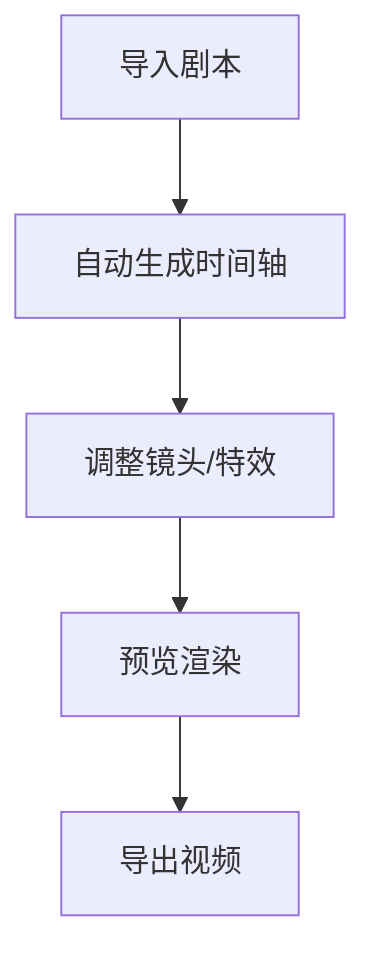

<!-- TOC -->
- [设计步骤分解](#设计步骤分解)
- [UML类图](#uml类图)
- [**视觉小说引擎功能清单**](#视觉小说引擎功能清单)
  - [开发优先级建议](#开发优先级建议)
  - [**0. 核心功能**](#0-核心功能)
  - [**1. 核心UI模块**](#1-核心ui模块)
  - [**2. 对话系统**](#2-对话系统)
  - [**3. 立绘管理系统**](#3-立绘管理系统)
  - [**4. 转场与特效**](#4-转场与特效)
  - [**5. 工程管理**](#5-工程管理)
  - [**6. 导出与调试**](#6-导出与调试)
- [**视觉小说引擎功能概要**](#视觉小说引擎功能概要)
  - [**1. 核心目标**](#1-核心目标)
  - [**2. 核心功能**](#2-核心功能)
  - [**3. 技术方案**](#3-技术方案)
  - [**4. 用户流程示例**](#4-用户流程示例)
  - [**5. 快速传达模板（用于新对话）**](#5-快速传达模板用于新对话)
- [日志](#日志)
  - [**格式解析**：](#格式解析)
  - [**日志级别说明**：](#日志级别说明)


### 设计步骤分解
1. 列出所有名词
2. 确定核心类
3. 定义关系
4. 填充功能


### UML类图

<!--  -->

```mermaid

classDiagram

    class TimelineController {
        -List<Record> records
            // records.add(new Record(...));    // 添加元素（无长度限制）
            // records.remove(0);              // 删除元素
            // int size = records.size();      // 获取当前元素数量
            //for (Record r : records) { ... }
        +insertRecord(index: number)
        +applyCameraTween()  // 处理镜头补间动画
        +renderAll()         // 批量渲染优化
    }

    class Record { <!-- 一条记录，用数组存储 -->
        -Int id <!-- 真的需要吗，数组ID不够吗 -->
        -Int durationFrames <!-- 持续时间-->
        -Dialogue dialogue <!-- 文本 -->
        -Camera camera <!-- 摄像机信息 -->
        -List<BackgroundVisual> bg <!-- ……应该不会有多个的，但留个余地先 -->
        -List<CharacterVisual> chars <!-- 保存立绘列表。有多个，但一般不会超过10个。注意渲染顺序 -->
        -List<EffectVisual> effects
        -List(AudioCommand )<!-- 保存音频操作。有多个，但一般不会超过10个（BGM，音频，语音）*2 -->

        +autoRecord() <!-- 生成下一条record时，有读入内容的直接赋值，否则继承上一条record的内容。除了对话 -->
        +calculateDuration() int  <!-- max(语音时长, 显示时长) -->
        +addVisual(VisualElement) <!-- 添加视觉元素 -->
        +addAudio(AudioCommand) <!-- 添加音频元素？ -->
        <!-- 反正肯定得有删除功能 -->
        +dltVisual(VisualElement) <!-- 删除视觉元素 -->
        +addAudio(AudioCommand) <!-- 删除音频元素？ -->
        +setCamera() <!-- 调整摄像机,自动对齐说话人 -->
        +renderPic（）<!-- 渲染预览图。渲染后缓存，没有修改就复用，会有开销过大的问题吗？分辨率多少比较好？ -->
        +renderVideo(recorder, durationFrames) <!-- 1.渲染当前Record的所有视觉元素到视频中，记录音频元素信息； 2.渲染音频元素 -->


        <!-- 自动继承上一条的视听元素（构造新节点时把前驱的作为参数发送 -->
        <!-- 那这样就得储存在class内部……？或者说需要做一个调用函数 -->
        <!-- 我觉得存储比较好，存储，然后每一段渲染……？ -->
        <!-- 也许音频不需要，音频还是只存起始点，在顺序渲染时控制就好。 -->
        <!-- 感觉会出bug，到时候再修 -->
    }

    
    class Camera {
        int posX, posY <!-- 对话内容 -->
        int zoom
        <!-- 每个record一条摄像机信息，记录位置和缩放。前后若不一致曲线连接运动。 -->
        <!-- 没有缩放的前提下：短背景，固定在画面中间；长背景：自动对齐说话人。 -->
        <!-- 缩放其实仅适用于CG吧一般，可以先不做，但留这个接口先 -->
    }

    class Dialogue { <!-- 对话内容 -->
        -String text <!-- 具体文本 -->
        -String scene <!-- 场景 -->
        -list<Character> speakerC <!-- 说话人。大都是单个，但可以多个。设一个默认的特殊独白/旁白，不留null，旁白强制单人说话 -->
        -String speaker <!-- 说话人名字 -->
        -String camp <!-- 所属阵营，默认从speakerC读取，可修改 -->
        -Align align <!-- 对齐方式 -->
        -int speed <!-- 文字显示速度的修改值，默认为0 -->
        -Emotion emotion <!-- 情绪。做立绘自动匹配用-->
        
        +Dialogue() <!-- 要考虑是空的情况……？留空和使用一个省略号占位符哪个方式好？ -->
        +emotionNLP() <!-- NLP分析情绪。做立绘自动匹配用-->
        +apply() <!-- 渲染到画面？文字自动换行 -->
    }

    class Align { <!--对齐-->
        <<enumeration>>
        LEFT
        MID
    }

    class VisualElement {
        <<abstract>>
        <!-- 所有可视化效果的父类 -->
        -int offsetFrames
        -int duration

        +apply(Graphics2D, float progress)<!-- 渲染到画面 -->
    }

    class CharacterVisual { <!-- 使用立绘 -->
        -Character cha <!-- 所属角色，读取一些信息用 -->
        -String imageId <!-- 这个要做成从库里读吗？ -->
        -float startAlpha <!-- 透明度 -->
        -int posX, posY <!-- 立绘坐标，从角色读取 -->
        -int adjX, adjY <!-- 用户手动调整偏差 -->
        -boolean dim <!-- 是否压暗，默认1；说话人0 -->

        +getPos(cha) <!-- 从角色读取立绘坐标, 角色身高与单张立绘偏差值 -->
        +apply(Graphics2D, float progress) 
    }

    class BackgroundVisual {
        -String imageId <!-- 路径。这个要做成从库里读吗？读库…… -->
        -boolean isTransition
        <!-- 留一个默认的单色转场 -->
        +apply(Graphics2D, float progress) void
    }

    class EffectVisual {
        <<abstract>>
        +apply(target: VisualElement， bubble需要读立绘坐标)
    }

    class BubbleEffect {
        <<enumeration>>
        FLOWER
        NOTE
        STAR
        HAPPY
        TAKE_OFFENCE
        SPEECHLESS
        CONFUSION
        EXCLAMATION
        QUESTION
        ELLIPSIS
    }
    class SpeakerEffect {
        <<enumeration>>
        JUMP
        SHAKE
    }
    class CharacterEffect {
        <<enumeration>>
        FADE_IN
        FADE_OUT
    }
    class GlobalEffect {
        <<enumeration>>
        MEMORY_FADE
    }
    class TransitionEffect { <!--转场-->
        <<enumeration>>
        FADE_IN_BLACK
        FADE_OUT_BLACK
        FADE_IN_WHITE
        FADE_OUT_WHITE
        SLIDE_IN <!--黑条条转场-->
        SLIDE_OUT
    }


    
    <!-- 音频。record里存信息，导出视频画面渲染时记录audioAction和起始帧到某全局变量里。画面渲染完再用这个变量记录渲染音频。这部分还没搞定……乱乱的 -->
    

    class AudioCommand {
        <<abstract>>
        +String audioId
        +int startFrame
        +execute(audioManager: AudioManager)*
    }

    class BgmCommand {
        +int loopCount
        +float fadeInSeconds
        +float fadeOutSeconds
        +execute() 淡入淡出处理, 循环播放
    }

    class SfxCommand {
        +float volume
        +float pan
        +execute() 即时单次播放
    }

    class VoiceCommand {
        +int textId
        +bool waitForFinish
        +execute() 即时单次播放
    }

    class AudioManager {
        -AudioPool pool
        +playBgm(cmd: BgmCommand)
        +playSfx(cmd: SfxCommand)
        +playVoice(cmd: VoiceCommand)
        +stopAll()
    }

    class AudioPool {
        -Map~String, AudioClip~ cache
        +preload(id: String)
        +getClip(id: String): AudioClip
    }

    <!-- 上面是做视频用的，下面是存储的 -->

    class Character { <!-- 角色 -->
        -String characterID <!-- 唯一ID -->
        -String characterName <!-- 角色名 -->
        -String color<!-- 代表色 -->
        -int height <!-- 角色身高，算坐标用的 -->
        -List<Portrait> portraits <!-- 立绘们。第一位是默认立绘，没有就用这个 -->
    }

    class Portrait { <!-- 角色立绘差分 -->
        -String portraitID <!-- 唯一ID -->
        -String imagePath <!-- 文件相对路径 -->
        -String portName <!-- 立绘名 -->
        -Emotion emotion <!-- 情绪。做立绘自动匹配用 -->
        -int posX, posY <!-- 面部位置左上角 -->
        -int length <!-- 面部长宽 -->
        -int adjX, adjY <!-- 用户手动调整偏差，如林黛玉受伤。那还得做界面？ -->
        -String thumbnailPath <!-- 缩略图路径 -->
        +generateThumbnail(posX, posY， length) <!-- 裁剪缩略图，保存到本地，删除旧缩略图 -->
    }
    
    class Emotion { <!-- 情绪。做立绘自动匹配用。前端写中文 -->
        <<enumeration>>
        NEUTRAL
        HAPPY
        ANGRY
        SAD
        ...
    }

    class 参数 {
        一些默认写死参数，写这里，做还原键也有用
        -UI的各部分的坐标
        -立绘做快速放置的五档按钮
        -相机默认数值
        -文字默认显示速度
        -立绘压暗的滤镜
        -导出的选项，例如分辨率？
    }


    %% 核心控制器
    TimelineController "1" *-- "*" Record : 管理
    TimelineController --> CameraTween : 使用

    %% Record核心组成
    Record "1" *-- "1" Dialogue : contains
    Record "1" *-- "1" Camera : contains
    Record "1" *-- "*" VisualElement : 聚合
    Record "1" *-- "*" AudioCommand : 聚合
    Dialogue --> Align : 使用

    %% 视觉元素继承体系
    VisualElement <|-- CharacterVisual
    VisualElement <|-- BackgroundVisual
    VisualElement <|-- EffectVisual
    EffectVisual <|-- BubbleEffect
    EffectVisual <|-- SpeakerEffect
    EffectVisual <|-- CharacterEffect
    EffectVisual <|-- GlobalEffect
    EffectVisual <|-- TransitionEffect

    %% 音频系统
    AudioCommand <|-- BgmCommand
    AudioCommand <|-- SfxCommand
    AudioCommand <|-- VoiceCommand
    AudioManager "1" *-- "1" AudioPool : 组合
    AudioManager ..> AudioCommand : 执行

    %% 角色系统
    Character "1" *-- "*" Portrait : 拥有
    Portrait --> Emotion : 关联
    CharacterVisual --> Character : 引用

    

    %% 工具类
    class CameraTween {
        +applyEasing(curve: string)
    }
    
   
```


### **视觉小说引擎功能清单**  


#### 开发优先级建议
**核心MVP**：
    基础Record渲染管线
    剧本→时间轴转换
    音频同步

**第二阶段**：
    简单镜头移动
    特效系统
    性能优化

**扩展功能**：
    高级NLP情绪分析
    3D摄像机效果
    多平台导出

    // 双时间轴处理
        void render() {
            videoTimeline.render();  // 视频渲染
            audioTimeline.flush();   // 音频事件批量提交
            ffmpeg.merge();          // 最终合成
        }


#### **0. 核心功能**
| 功能 | 说明 |
|------|------|
| **剧本快速转换** | 用户拖入剧本并设置好格式后快速将文本转化为时间轴 |
| **根据对话自动选择立绘** | 用NLP库，匹配情绪？ |

[说话人]说话文本（情绪）换行；若没有说话人，则和上一条相同
注意支持中文

#### **1. 核心UI模块**
| 功能 | 说明 |
|------|------|
| **左上角 - 场景名称** | 片头逐字出现，后续硬切 |
| **右上角 - 菜单按钮** | 保存/加载工程、设置 |
| **中央 - 画面区域** | 背景 + 立绘 + CG 分层渲染 |
| **底部 - 对话栏** | 包含角色名（带颜色）和对话文本 |

---

#### **2. 对话系统**
| 功能 | 细节 |
|------|------|
| **文本显示** | 逐字出现，支持左对齐（对话）和居中（旁白） |
| **自动时长** | 根据语音/文本长度自动计算显示时间 |
| **角色名显示** | 支持无角色名（旁白），文字过长时自动换行 |
| **多人对话模式** | 默认单人高亮，按住`Ctrl`可多选说话人 |
| **立绘-对话关联** | 非强制绑定（可有立绘无对话，或有对话无立绘） |

---

#### **3. 立绘管理系统**
| 功能 | 实现方案 |
|------|----------|
| **自动高亮** | 说话人立绘自动置顶并高亮，其他人变暗 |
| **位置调整** | 提供左右定位按钮（居中/对齐上一条） |
| **过渡效果** | 可配置淡入淡出/硬切/叠加消失 |
| **动画控制** | 支持震动、蹦跳等小动画 |
| **锚点设置** | 每张立绘标记头部位置，支持手动微调 |

---

#### **4. 转场与特效**
| 类型 | 参数 |
|------|------|
| **镜头移动** | 长背景，移动镜头对准说话人，曲线 |
| **黑屏转场** | 慢入慢出（用于章节切换） |
| **横向黑条** | 过场动画（从左到右扫描） |
| **白屏闪切** | 快速淡入淡出（紧急场景） |
| **回忆滤镜** | 叠加灰度/模糊效果 |
| **摄像机** | 每个record一条摄像机信息，记录位置和缩放。前后若不一致曲线连接运动。没有缩放的前提下：短背景，固定在画面中间；长背景：自动对齐说话人。缩放其实仅适用于CG吧一般，可以先不做，但留这个接口先 |


---

#### **5. 工程管理**
| 功能 | 说明 |
|------|------|
| **数组编辑** | 链表好像没有优化很多，用数组。支持右键插入/删除节点，回车追加新对话 |
| **资源库** | 角色、背景、BGM分库管理，支持导入/导出预设。建立总库，可以在单个工程里选择会用的角色，总库里有角色包 |
| **角色参数** | 姓名、颜色、阵营、默认立绘、身高基准 |
| **BGM控制** | 标记起始/结束位置，自动处理交叉淡入淡出 |

---

#### **6. 导出与调试**
| 功能 | 备注 |
|------|------|
| **多分辨率导出** | 1080p/720p等预设选项 |
| **透明背景导出** | 低优先级（需Alpha通道支持） |
| **实时预览** | 立绘位置/动画效果即时反馈 |

---


### **视觉小说引擎功能概要**  

#### **1. 核心目标**  
开发一款**自动化视觉小说视频生成工具**，能够：  
- **将剧本转换为时间轴视频**（自动处理立绘、背景、对话、音频）  
- **高度还原《边狱巴士》风格UI**（带动态镜头移动、特效）  
- **减少重复剪辑工作**（批量渲染，一键导出）  

---

#### **2. 核心功能**  
| 模块               | 功能要点                                                                 |
|--------------------|--------------------------------------------------------------------------|
| **剧本解析**       | 支持结构化剧本（如 `[角色]对话{情绪}` → 自动匹配立绘）                   |
| **资源管理**       | 全局库（角色/背景/音频） + 工程级引用（避免混乱）                        |
| **时间轴编辑**     | `Record` 数组管理，支持插入/删除/移动节点                                |
| **镜头控制**       | 自动对齐说话人，缓动曲线移动（长背景横向滑动）                           |
| **特效系统**       | 气泡动画、立绘震动、全局滤镜（回忆模式）                                 |
| **音频同步**       | 背景音乐（BGM）、音效（SFX）、语音（Voice）分层管理                      |
| **导出渲染**       | 支持多分辨率导出（1080p/720p）                                          |

---

#### **3. 技术方案**  
| 组件               | 选型理由                                                                 |
|--------------------|--------------------------------------------------------------------------|
| **开发语言**       | Java（你的主力语言） + JavaFX（UI）                                     |
| **视频处理**       | JavaCV（FFmpeg封装）                                                    |
| **数据存储**       | SQLite（轻量级，支持标签查询）或JSON（初期快速原型）                    |
| **多格式支持**     | 图片（PNG/JPEG）、音频（MP3/WAV）、视频（导出统一MP4）                  |

---

#### **4. 用户流程示例**  


---

#### **5. 快速传达模板（用于新对话）**  
> **我正在开发一个视觉小说视频生成工具**，核心需求如下：  
> 1. **输入**：结构化剧本 → **输出**：带立绘/背景/对话的视频  
> 2. **特色功能**：  
>    - 自动镜头移动（长背景横向滑动）  
>    - 基于情绪的立绘匹配（NLP分析文本）  
>    - 时间轴链表编辑（Record节点管理）  
> 3. **技术栈**：Java + JavaCV + SQLite  
>   
> **当前进度**：[填写你的最新进展]  
> **待解决问题**：[具体问题描述]  

需要补充/修改任何部分吗？可以立即调整！ (•̀ᴗ•́)و


### 日志

#### **格式解析**：
| 部分                | 含义                          | 示例                      |
|---------------------|-------------------------------|---------------------------|
| `2023-12-01 14:30:25` | 时间戳                        | 精确到秒                  |
| `[main]`            | 线程名                        | 主线程或其他线程名         |
| `DEBUG`             | 日志级别                      | DEBUG/INFO/WARN/ERROR     |
| `HSLTextureColorizer` | 类名                          | 知道日志来自哪个类         |
| `-`                 | 分隔符                        |                           |
| `开始处理纹理着色...` | 具体消息                      | 自定义的描述信息           |

#### **日志级别说明**：
| 级别    | 使用场景                                                                 |
|---------|--------------------------------------------------------------------------|
| **ERROR** | 严重错误，程序可能无法继续运行                                           |
| **WARN**  | 警告，有问题但不影响程序运行（如异常参数）                               |
| **INFO**  | 重要信息，如程序启动、关键操作完成                                       |
| **DEBUG** | 调试信息，详细的操作记录（建议在开发环境开启，生产环境关闭）             |
| **TRACE** | 最详细的日志，记录每一个步骤（性能开销大，慎用）                         |

---
